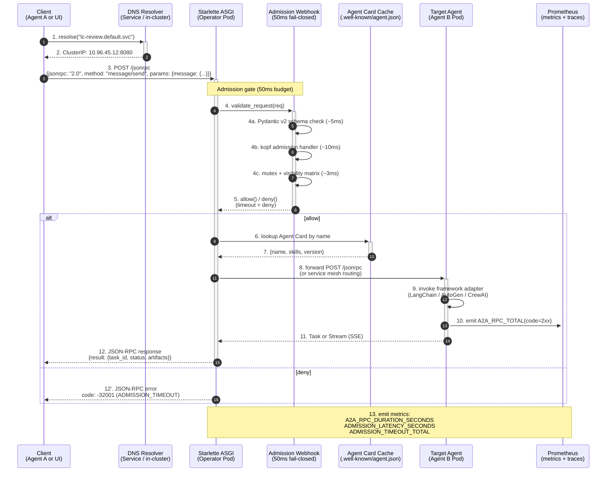

# A2A Protocol Flow — superteam-a2a

> **Audience**: framework maintainers, A2A protocol contributors, security reviewers
>
> **Source**: [`docs/design/L1-architecture.md`](../design/L1-architecture.md) v0.2.0 §3 + [`docs/adr/CONSTITUTION.md`](../adr/CONSTITUTION.md) §13.6
>
> **Reference**: [Google A2A spec](https://github.com/google/A2A) v0.3+

## End-to-end message flow

## Phase-by-phase breakdown

### Phase 1: Discovery (steps 1-2)

- **DNS-style resolution** maps logical names to K8s Services
- Built-in resolver supports cross-namespace queries: `agent-name.namespace.svc`
- Future: cross-cluster federation via `agent-name.cluster-b.svc`

### Phase 2: Admission (steps 3-5)

The admission gate is the security backbone of superteam-a2a:

- **Pydantic v2 schema validation** — rejects malformed JSON-RPC envelopes in <5ms
- **kopf admission handler** — invokes registered validators in <10ms
- **Mutex + visibility matrix** — ensures concurrent ops don't violate scope invariants in <3ms
- **Hard timeout: 50ms** — failure is denial (fail-closed), not allow

This is the **50ms fail-closed** invariant. See [`docs/adr/CONSTITUTION.md`](../adr/CONSTITUTION.md) §6 (security) for the rationale.

### Phase 3: Routing (steps 6-8)

- **Agent Card cache** provides `name`, `skills`, `version` for routing decisions
- Cache is populated at agent registration time and invalidated on CRD update
- **Forward POST** to the resolved target via in-cluster networking

### Phase 4: Execution (steps 9-11)

- **Framework adapter** invokes the underlying LLM agent (LangChain, AutoGen, etc.)
- Adapter is responsible for converting A2A `Message` → framework-native call
- Result is wrapped back into A2A `Task` or streamed as `Artifact` (SSE)

### Phase 5: Observability (step 13)

Every phase emits Prometheus metrics:

| Metric | Type | Labels |
|---|---|---|
| `a2a_rpc_duration_seconds` | histogram | `method`, `code` |
| `admission_latency_seconds` | histogram | `validator` |
| `admission_timeout_total` | counter | `reason` |
| `a2a_rpc_total` | counter | `method`, `code` |

## Error code mapping

| Code | Source | Meaning |
|---|---|---|
| `-32700` | JSON-RPC 2.0 | Parse error |
| `-32600` | JSON-RPC 2.0 | Invalid Request |
| `-32601` | JSON-RPC 2.0 | Method not found |
| `-32602` | JSON-RPC 2.0 | Invalid params |
| `-32603` | JSON-RPC 2.0 | Internal error |
| `-32001` | A2A | ADMISSION_TIMEOUT |
| `-32002` | A2A | AGENT_NOT_FOUND |
| `-32003` | A2A | SKILL_NOT_SUPPORTED |
| `-32004` | A2A | SCOPE_VIOLATION |
| ... | ... | (23 total, see [`docs/spec/L3-file-specs/L3-knowledge-service.md`](../spec/L3-file-specs/L3-knowledge-service.md) §8) |

## Where this diagram appears

- Launch channels: PH / HN / dev.to / Reddit / 掘金 — referenced as "A2A protocol flow"
- [`docs/sdk/`](../../sdk/) — SDK reference
- Framework maintainer docs — "how to wire your adapter"

## Rendering notes

- Mermaid sequence diagrams render natively in GitHub + mkdocs-material
- For static SVG export: `mmdc -i a2a-protocol-flow.md -o a2a-protocol-flow.svg`
- Color coding: blue = system, green = external, orange = security gate
