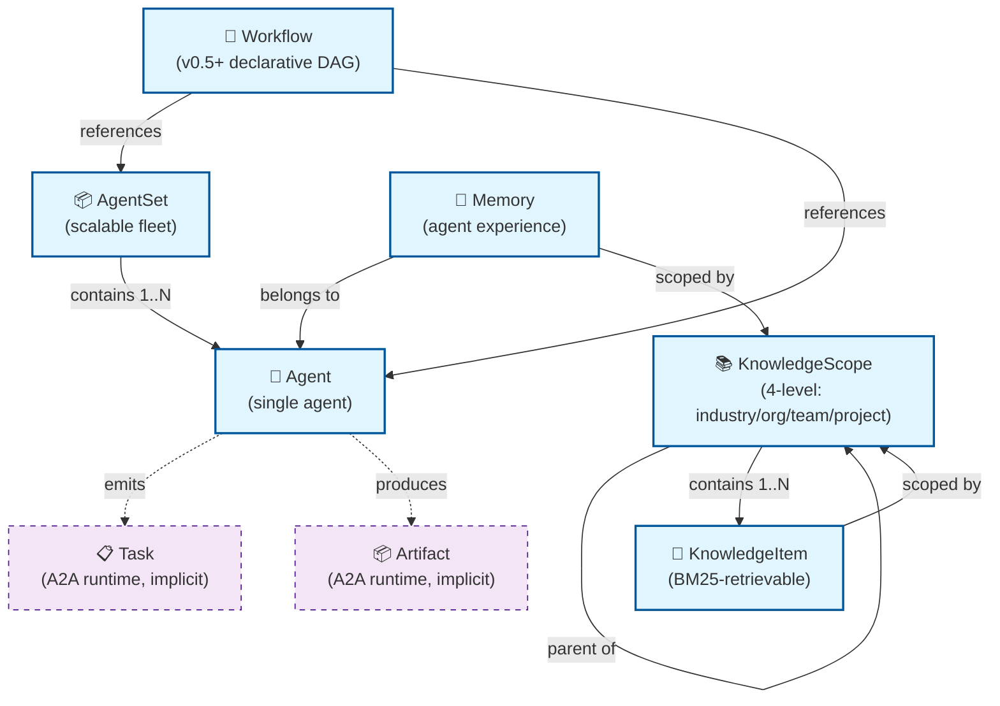

# CRD Relationships — superteam-a2a

> **Audience**: framework maintainers writing adapters, contributors extending CRDs
>
> **Source**: [`docs/spec/L1-system-spec.md`](../spec/L1-system-spec.md) v0.2.0 + [`docs/design/L1-architecture.md`](../design/L1-architecture.md) §3.3
>
> **Status**: ✅ ready for use in docs site + adapter SDK reference

## CRD taxonomy



## Primary CRDs (6 v1alpha1)

### `Agent`

A single AI agent wrapped in a K8s resource.

```yaml
apiVersion: superteam.io/v1alpha1
kind: Agent
metadata:
  name: lc-review
spec:
  framework: langchain  # langchain | autogen | crewai | semantic-kernel | strands | smolagents
  model: gpt-4o
  systemPrompt: "You review pull requests..."
  replicas: 1
  resources:
    cpu: 500m
    memory: 1Gi
```

### `AgentSet`

A horizontally-scalable fleet of agents with shared config.

```yaml
apiVersion: superteam.io/v1alpha1
kind: AgentSet
metadata:
  name: at-test-fleet
spec:
  template:
    spec:
      framework: autogen
      model: claude-3-opus
  replicas: 3
  scaleTarget:
    minReplicas: 1
    maxReplicas: 10
    targetCPUUtilization: 70
```

### `Workflow` (v0.5+)

Declarative DAG of agent steps.

```yaml
apiVersion: superteam.io/v1alpha1
kind: Workflow
metadata:
  name: pr-review-pipeline
spec:
  steps:
    - name: plan
      agentRef: lc-planner
    - name: code
      agentRef: lc-coder
      dependsOn: [plan]
    - name: review
      agentRef: lc-review
      dependsOn: [code]
```

### `KnowledgeScope`

4-level scope hierarchy (industry → org → team → project).

```yaml
apiVersion: superteam.io/v1alpha1
kind: KnowledgeScope
metadata:
  name: acme-platform-team
spec:
  level: team  # industry | org | team | project
  parentRef:
    name: acme-platform  # links to next level up
```

### `KnowledgeItem`

A piece of knowledge with BM25-retrievable content.

```yaml
apiVersion: superteam.io/v1alpha1
kind: KnowledgeItem
metadata:
  name: k8s-admission-patterns
spec:
  scopeRef:
    name: acme-platform-team
  content: |
    Kubernetes admission webhooks should use 50ms fail-closed...
  tags: [kubernetes, admission, security]
```

### `Memory`

An agent's persistent experience record.

```yaml
apiVersion: superteam.io/v1alpha1
kind: Memory
metadata:
  name: lc-review-memory
  labels:
    agent: lc-review
spec:
  scopeRef:
    name: acme-platform-team
  confidence: 0.85  # 0.0 - 1.0
  decayRate: 0.01   # per day
  content: |
    Reviewed PR #42 — found 3 issues with admission timeout handling
```

## Implicit runtime objects (not CRDs)

These are A2A protocol types, not K8s resources. They exist in-memory during agent execution:

- **`Task`** — a unit of work in the A2A protocol (`tasks/send`, `tasks/get`, `tasks/cancel`)
- **`Artifact`** — output of a Task, streamed via SSE

## Visibility matrix (5 dimensions)

A Memory or KnowledgeItem is visible along 5 axes:

1. **industry** — visible to all orgs in the same industry
2. **org** — visible to all teams in the same org
3. **team** — visible to all projects in the same team
4. **project** — visible to the same project only
5. **agent-private** — visible to the owning agent only

This is enforced by the admission webhook (50ms budget).

## Scope inheritance

```
industry
   └── org
         └── team
               └── project
```

Each level can read its own + ancestor levels (read-up, not read-across or read-down).

## Adapter SDK contract

To add a new framework adapter, you implement:

```python
class MyFrameworkAdapter(AgentAdapter):
    def build_agent(self, spec: AgentSpec) -> Any:
        # Return framework-native agent
        ...
    
    async def handle_message(self, message: A2AMessage) -> A2AResponse:
        # Convert A2A → framework → A2A
        ...
```

The adapter receives the `Agent` CRD spec and must produce an A2A-compliant endpoint. See [`docs/sdk/`](../../sdk/) for the full SDK.

## Where this diagram appears

- [`docs/sdk/`](../../sdk/) — adapter SDK reference
- Launch channels: framework maintainer outreach (LangChain / AutoGen / CrewAI Discords)
- [`docs/reviews/l3-3-adapter-sdk-spec-review.md`](../reviews/l3-3-adapter-sdk-spec-review.md) — 22-framework coverage plan

## Rendering notes

- Mermaid renders natively in GitHub + mkdocs-material
- Solid lines: primary CRD relationships
- Dashed lines: implicit A2A runtime objects
- For static SVG export: `mmdc -i crd-relationships.md -o crd-relationships.svg`
