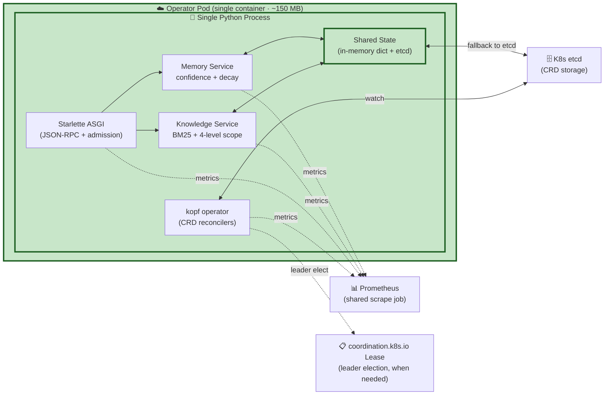

# Single-Process Backend — ADR-0006 D 方案

> **Audience**: architecture reviewers, K8s operators, contributors considering IPC
>
> **Source**: [`docs/adr/0006-memory-transport.md`](../adr/0006-memory-transport.md) v1.0 Accepted
>
> **Status**: ✅ D 方案 is the implemented architecture in v0.1.0+

## The decision

Knowledge Service + Memory Service run **inside the Operator Pod** as a single Python process. The Operator, the A2A ASGI server, Knowledge Service, and Memory Service all share:
- One `kopf` operator loop
- One Starlette ASGI app instance
- One process boundary
- One Deployment
- One RBAC Role
- One health check
- One Prometheus scrape job

## Why D 方案? (decision matrix)

| Option | Pros | Cons | Verdict |
|---|---|---|---|
| **A. UDS (Unix Domain Socket)** | Low latency | Complex deployment, platform-specific | Backup |
| **B. Shared runtime** | Familiar pattern | Process state explosion | ❌ Rejected |
| **C. Shared mmap** | Fast | Fragile, hard to debug, OS-specific | ❌ Rejected |
| **D. Single process** | Simple, low latency, single leader | ~150 MB container | ✅ **Accepted** |
| **E. HTTP loopback** | Standard | +50ms per call, no benefit | ❌ Rejected |

## What D 方案 gives us

### Operational simplicity

- **One Deployment** to manage (vs. 2-3 in the rejected options)
- **One RBAC Role** (single audit boundary)
- **One health check** endpoint
- **One Prometheus scrape job** (single source of truth for SLO)
- **One leader election** (when sharding is needed)

### Performance

- **No IPC serialization** — calls are direct Python function calls
- **~5-10ms** for Knowledge query end-to-end (vs. 50-100ms with HTTP loopback)
- **BM25 retrieval p95 < 50ms** for 1000 documents

### Code simplicity

- **No API contracts** between Knowledge and Memory — direct Python calls
- **No protocol versioning** between internal services
- **No retry logic** for transient IPC failures

## Trade-offs accepted

| Trade-off | Mitigation |
|---|---|
| Container size ~150 MB (vs ~80 MB) | Acceptable — both well under typical Python image baseline |
| Memory leak in one service affects both | Single process restart cycle is fine |
| Can't scale Knowledge independently of Memory | Not needed in v0.1.0 (both have similar load profiles) |
| Single point of failure | K8s Deployment restart + PodDisruptionBudget |

## When to revisit

D 方案 may need to be revisited if:

1. **Memory footprint** grows beyond ~500 MB (consider C/Cython for hot path)
2. **Knowledge service** needs independent scaling (consider sharding by scope)
3. **Multi-tenant isolation** becomes a requirement (consider per-namespace MemoryBackend instances)

But for v0.1.0 → v1.0.0, D 方案 is the right call. The trade-offs are well-understood and bounded.

## Implementation evidence

The single-process architecture is enforced by:

- `packages/operator/main.py` — single `kopf` operator + uvicorn ASGI server in one process
- `services/knowledge-memory-service/` — Knowledge + Memory services share the same process as the Operator
- `helm/operator/Chart.yaml` — single Deployment template
- `tests/integration/` — integration tests assume same-process communication

## Where this diagram appears

- [`docs/adr/0006-memory-transport.md`](../adr/0006-memory-transport.md) — primary rationale document
- Launch channels: PH / HN / Reddit / 掘金 — referenced as "the architectural decision that mattered"
- [`README.md`](../../README.md) §"Single-process D 方案"
- New contributor onboarding — "why we chose this"

## Rendering notes

- Mermaid renders natively in GitHub + mkdocs-material
- Green box (decision) is the highlight — what we chose
- For static SVG export: `mmdc -i single-process-backend.md -o single-process-backend.svg`
