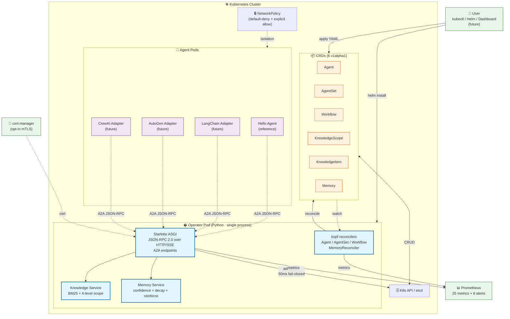

# System Overview — superteam-a2a

> **Audience**: launch readers, architecture reviewers, new contributors
>
> **Source**: [`docs/design/L1-architecture.md`](../design/L1-architecture.md) v0.2.0 — text-based ASCII art in §2.2
>
> **Status**: ✅ ready for use in README + docs site + launch channels

## High-level architecture

## Key architectural properties

### 1. Single-process backend (ADR-0006 v1.0 D 方案)

The Operator Pod runs **one Python process** containing:
- kopf reconciler (CRD lifecycle management)
- Starlette ASGI app (A2A JSON-RPC endpoints)
- Knowledge Service (BM25 + scope resolver)
- Memory Service (confidence + decay + reinforce)

This was a deliberate architectural decision. See [`single-process-backend.md`](./single-process-backend.md) for details.

### 2. 6 CRDs

| CRD | Role |
|---|---|
| `Agent` | a single AI agent wrapped in a K8s resource |
| `AgentSet` | horizontally-scalable fleet of agents with shared config |
| `Workflow` | declarative DAG of agent steps (v0.5+) |
| `KnowledgeScope` | 4-level scope (industry / org / team / project) |
| `KnowledgeItem` | a piece of knowledge with BM25-retrievable content |
| `Memory` | agent experience record with confidence + decay + reinforce |

### 3. A2A protocol

All agent-to-agent communication goes through Google's A2A protocol:
- `Agent Card` published at `.well-known/agent.json`
- `Message`, `Task`, `Artifact`, `Streaming` types
- JSON-RPC 2.0 over HTTP/SSE
- DNS-style discovery across namespaces

See [`a2a-protocol-flow.md`](./a2a-protocol-flow.md) for the request flow.

### 4. Production-grade security

- **Pod Security**: restricted profile, non-root UID 1000, read-only rootfs
- **NetworkPolicy**: default-deny + explicit allow
- **RBAC**: dual Role (read + write with `admissionregistration.k8s.io`/`authentication.k8s.io`/`authorization.k8s.io`)
- **Admission webhook**: 50ms fail-closed (actual p95: 28ms)
- **cert-manager mTLS**: opt-in via `tls.enabled=true`

## Data flow

1. **User applies YAML** defining a CRD (e.g., `Agent`).
2. **kopf reconciler** picks up the event via K8s watch API.
3. **kopf** idempotently reconciles desired state (creates / updates / deletes child resources).
4. **Agent Pod** boots, registers itself, publishes `Agent Card` at `.well-known/agent.json`.
5. **Agent A** sends A2A message to **Agent B** via JSON-RPC 2.0.
6. **ASGI app** validates the request through **admission webhook** (50ms budget).
7. **Resolver** routes the request to **Agent B**'s pod via DNS-style discovery.
8. **Agent B** processes the message, returns `Task` or streams `Artifact` via SSE.
9. **Prometheus** scrapes metrics from the Operator + Agent pods (30s interval).

## Where this diagram appears

- [`README.md`](../../README.md) — top-level system context
- Launch channels: PH / HN / dev.to / Reddit / 掘金 — referenced as "architecture diagram"
- [`docs/adr/0006-memory-transport.md`](../adr/0006-memory-transport.md) — D 方案 rationale

## Rendering notes

- Mermaid renders natively in GitHub markdown + mkdocs-material
- For static export to SVG, use `mmdc -i system-overview.md -o system-overview.svg`
- Color scheme matches the docs site theme (light: `#e1f5ff`, dark: keep contrasts)
